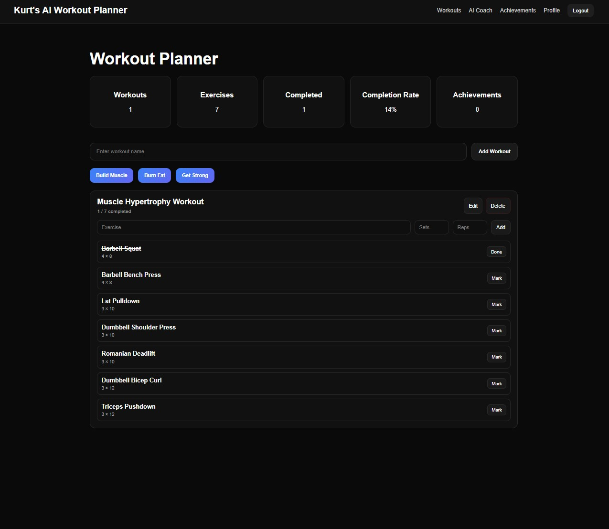
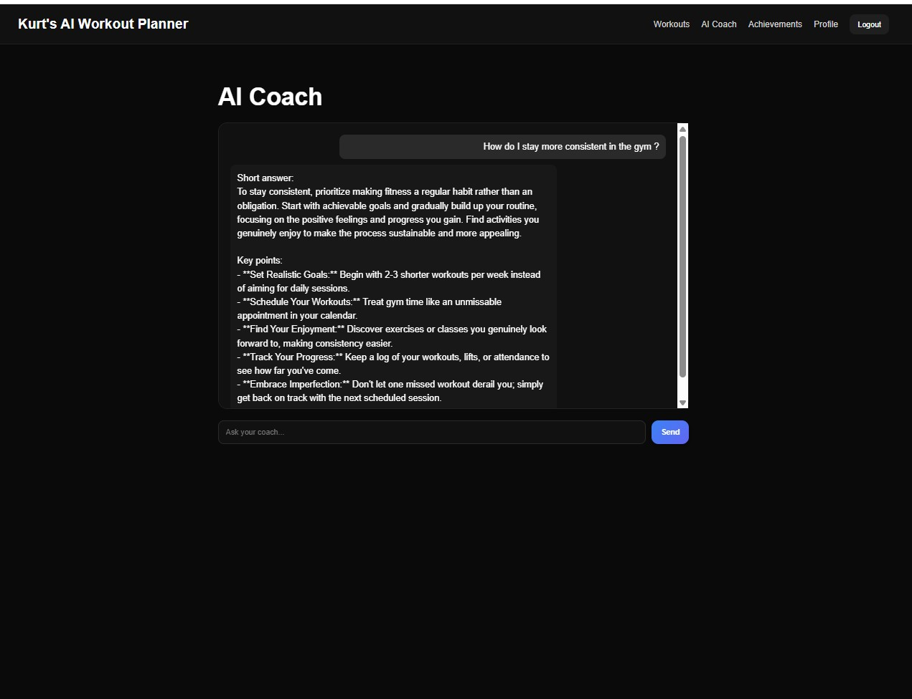
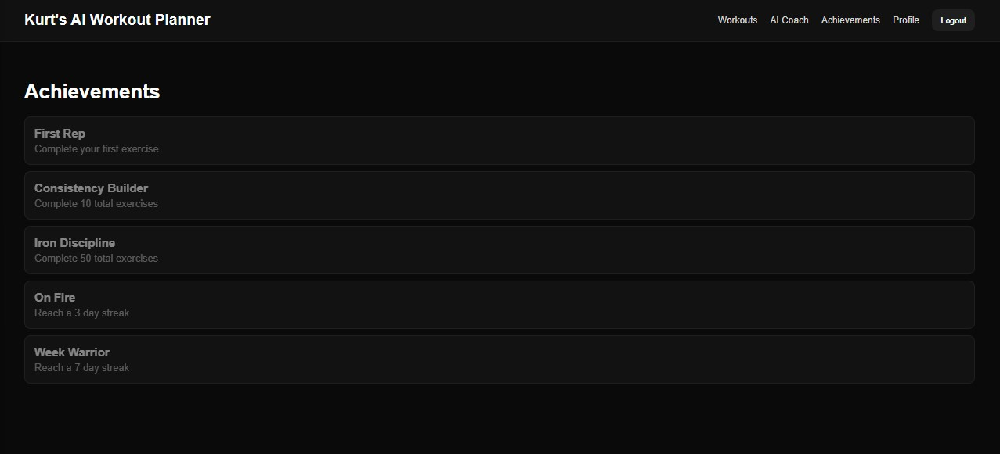
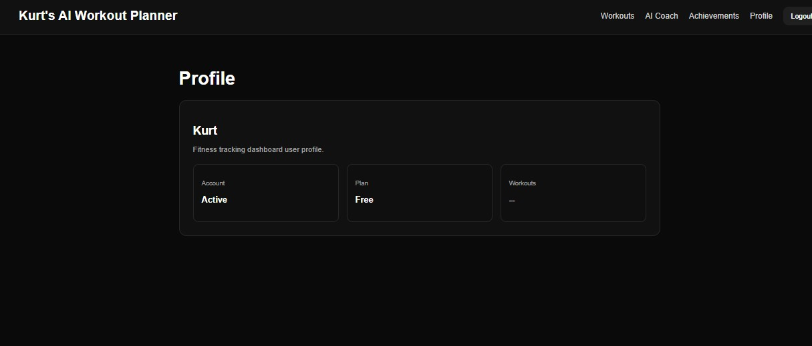

WORKOUT TRACKER APP

An AI-powered full stack fitness tracking application that i build using React,Node.js,Express,MongoDB and Google Gemini API.

Features:

.Authentication
.Workout Management
.AI Workout Generator
.AI Coach
.Progress Tracking
.Achievements

Photos:

Tech Stack:

Frontend

React
React Router
JavaScript
Inline CSS Styling

Backend

Node.js
Express.js
MongoDB
Mongoose

AI
Google Gemini API

How to Install:

Step 1 - Clone the Repo

git clone <https://github.com/Kurttt02/workoutplanner1>

Step 2 - Set up the backend

cd backend
npm install (All the dependencies)
Create YOUR OWN .env including:
MONGO_URI=YOUR MONGODB CONNECTION STRING
GEMINI_API_KEY=YOUR GEMINI KEY
Dont forget to SAVE the.env
npm start(Make sure you are in backend terminal)
Server will now run on http://localhost:5000

Step 3 -Set up the frontend

cd frontend
npm install
npm start(Make sure you are in frontend terminal or project)
Server will now run on http://localhost:3000

Future Improvements

In the future I would like to add:

.More achievements
.Excercize database (so you dont have to type in you can also click and browse through a catalog)
.Mobile Compatability(Via App)
.Add a streak like feature
